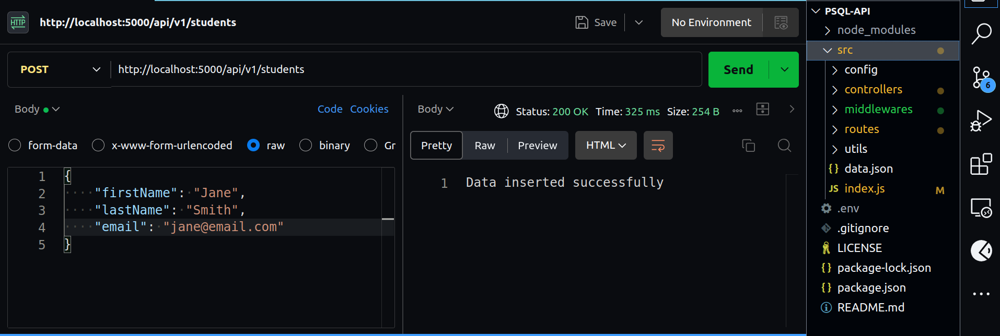
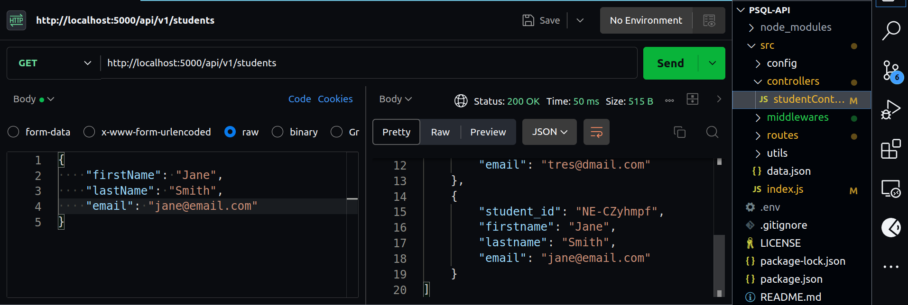
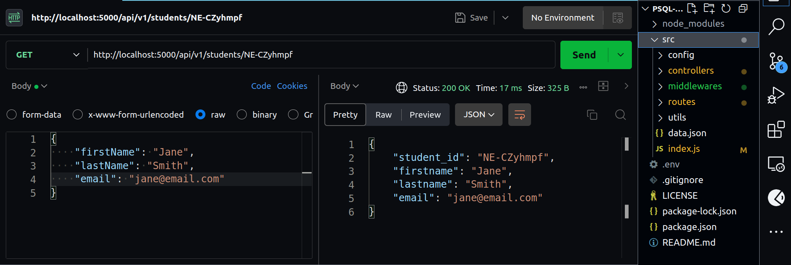
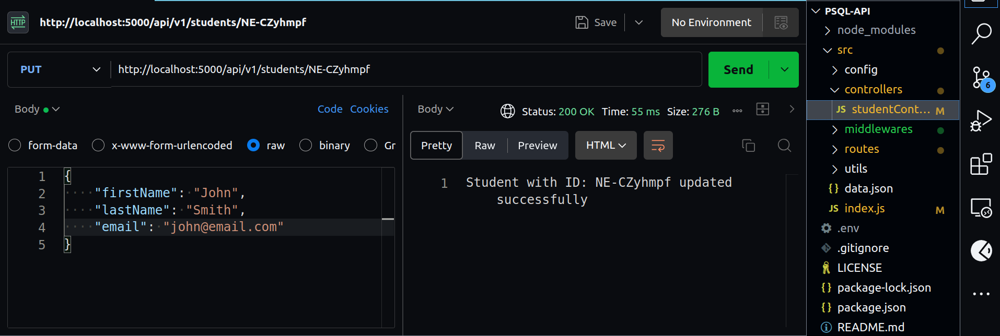
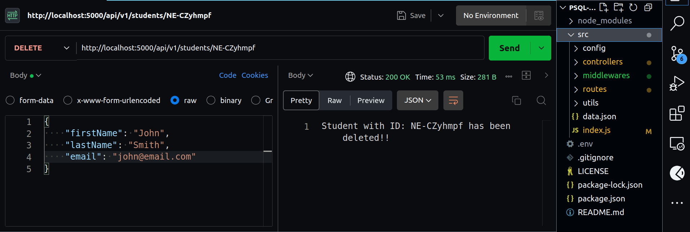

# Mini Project - Store and retrieve data in PostgreSQL with CRUD ops of an Express.js API/server

 &nbsp;
 &nbsp;


A simple REST API for students data management, which implements full CRUD operations on a Postgres database. Built with **Node.js**, **Express.js**, **PostgreSQL** and proper **RESTful API principles**.

<br>

##

## 🎯 Objective:

The goal of this assessment is to create a simple Express.js API that connects to a PostgreSQL database and performs basic CRUD operations on the database.

## 📌 Project Tasks:

- Set up RESTful API with Express.js.
- Install dependencies (pg and express).
- Set up a PostgreSQL database with a table.
- Connect to database using 'pg' module.
- Create routes to implement CRUD operations including; GET, POST, PUT, DELETE items by ID.
- Handle appropriate error responses and validate request params and body data.
- Test API endpoints with Postman.

## 🏷️ Features

- ✅ Full CRUD operations
- ✅ Data validation
- ✅ Error handling
- ✅ RESTful design
- ✅ PostgreSQL db storage
- ✅ JSON request/response

## 🚀 Setup Instructions

### Prerequisites

- Node.js v18+
- npm or yarn

### Installation

1. Clone repository:

   ```bash
   git clone https://github.com/tivereidoro/psql-api.git

   cd psql-api
   ```

2. Install dependencies:

   ```bash
   npm install
   ```

3. Create and update your .env file:

   ```bash
   PORT=your_app_port

   PG_DB_HOST=database_host
   PG_DB_USER=database_user
   PG_DB_PASSWD=database_password
   PG_DB_PORT=db_connection_port
   PG_DB_NAME=database_name

   ```

4. Start server:
   ```bash
   npm start
   ```

Server runs on `http://localhost:${PORT}`

<br>

## 📝 API Documentation:

### Base URL:

`http://localhost:5000`

### Root URL route ('/api/v1'):

Returns :

```bash
   {
      message: "API is working!"
   }
```

### Endpoints:

| Method | Endpoint             | Description                   |
| :----- | :------------------- | :---------------------------- |
| GET    | /api/v1/students     | Retrieve all students         |
| GET    | /api/v1/students/:id | Retrieve single student by id |
| POST   | /api/v1/students     | Create new student            |
| PUT    | /api/v1/students/:id | Update student by id          |
| DELETE | /api/v1/students/:id | Delete student by id          |

<br>

## ⚙️ Testing the API with Example Requests:

**1. Create Student: &nbsp; ( POST &nbsp; `/api/v1/students`)**

Request body:

```bash
   {
      "firstname": "Jane",
      "lastname": "Smith",
      "email": "jane@email.com",
   }
```

An ID will be automatically generated for each user on the server.



**Expected response: (200 OK):**

`Data inserted successfully.`

<br>

**2. Get All Students: &nbsp; ( GET &nbsp; `/api/v1/students`)**

Request URL:

```
   http://localhost:5000/api/v1/students
```



**Expected response: (200 OK)**

```
[
   {
      "student_id": "NE-CZyhmpf",
      "firstname": "Jane",
      "lastname": "Smith",
      "email": "jane@email.com"
   }
]
```

<br>

**3. Get a student by ID: &nbsp; ( GET &nbsp; `/api/v1/students/:id`)**

Request URL:

```
   http://localhost:5000/api/v1/students/NE-CZyhmpf
```



**Expected response: (200 OK)**

```
   {
      "student_id": "NE-CZyhmpf",
      "firstname": "Jane",
      "lastname": "Smith",
      "email": "jane@email.com"
   }
```

<br>

**4. Modify student data by ID: &nbsp; ( PUT &nbsp; `/api/v1/students/:id`)**

Request URL:

```
   http://localhost:5000/api/v1/students/NE-CZyhmpf
```

Request body:

```
   {
      "firstname": "John",
      "lastname": "Smith",
      "email": "john@email.com"
   }
```



**Expected response: (201 OK)**

`Student with ID: 'NE-CZyhmpf' updated successfully`

<br>

**5. Delete student data by ID: &nbsp; ( DELETE &nbsp; `/api/v1/students/:id`)**

Request URL:

```
   http://localhost:5000/api/v1/students/NE-CZyhmpf
```



**Expected response: (201 OK)**

`Student with ID: 'NE-CZyhmpf' has been deleted!!`

<br>

### Test with cURL:

Open Postman, select the required request method (GET/POST/PUT/DELETE) and input a json data into the body section where necessary, then click send to get the response.

**OR**

Use cURL on the CLI to test send request to the endpoint. Here is an example;

```
curl -X POST http://localhost:5000/api/v1/students \
-H "Content-Type: application/json" \
-d '{"firstName":"Jane","lastName":"Smith","email":"jane@email.com"}'
```

<br>

## 📜 License:

This project is licensed under the MIT License - see the [LICENSE](./LICENSE) file for details.

## 👨🏽‍💻 Author:

Application written by [Tivere IDORO](https://www.tivere.tech).

...
